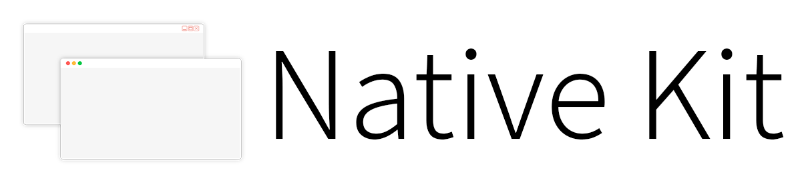
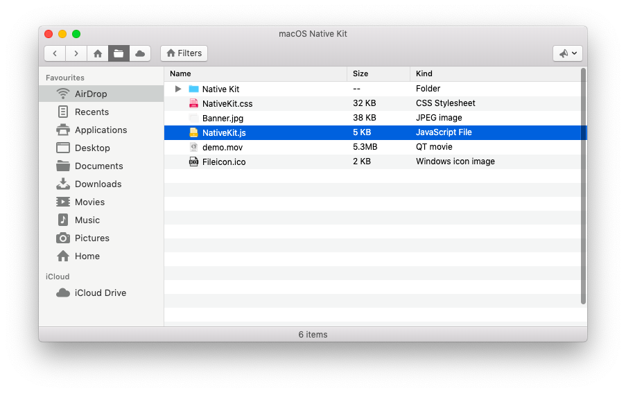

   
  
 

Native Kit is a new way to build Electron apps for macOS and Windows with all the native looks for the different operating systems.

[Native Kit Website](https://www.nativekit.co)

## Free and Open Source
Native Kit is fully free and is Open Source under the GPL Licence 3.0 or higher. You have the freedom to clone and use the product repository, make changes, redistribute and fork and rebrand it! Go ahead, make a change!

## macOS

**Screenshot:**

« The above app was created using Native Kit! »

<h3>Development Track:</h3>

- [x] Font Imports - San Francisco and Entypo
- [x] Global Style Rules
- [x] Window Wrapper
- [x] Text Style Rules
- [x] Floats and Clearfixes
- [x] Paddings
- [x] Draggable Regions
- [x] Title Bars
- [x] Toolbars
- [x] Buttons
- [x] Dropdown Menu *
- [x] Box Layouts
- [x] Sidebars
- [x] Navigation Groups
- [x] Image Views
- [x] Tables
- [x] Lists
- [x] Forms
- [ ] Popovers
- [x] Tab Views
- [x] Progress Indicators
- [x] Indeterminate Progress Spinner *
- [x] Panes

<small>* Feature Requires additional JavaScript library to be included.</small>
 
<small><b>Note: </b>This list is not the complete interpretation of the features of the final product. Features will be added and removed as per the progress in the development. Windows development has not started yet and would start soon!</small>

# Contributing to Native Kit
We love your input! We want to make contributing to this project as easy and transparent as possible, whether it's:

- Reporting a bug
- Discussing the current state of the code
- Submitting a fix
- Proposing new features
- Becoming a maintainer

## We Develop with Github
We use github to host code, to track issues and feature requests, as well as accept pull requests.

## We Use [Github Flow](https://guides.github.com/introduction/flow/index.html), So All Code Changes Happen Through Pull Requests
Pull requests are the best way to propose changes to the codebase (we use [Github Flow](https://guides.github.com/introduction/flow/index.html)). We actively welcome your pull requests:

1. Fork the repo and create your branch from `master`.
2. If you've added code that should be tested, add tests.
3. If you've changed APIs, update the documentation.
4. Ensure the test suite passes.
5. Make sure your code lints.
6. Issue that pull request!

## Any contributions you make will be under the MIT Software License
In short, when you submit code changes, your submissions are understood to be under the same [GNU General Public License v3.0](https://choosealicense.com/licenses/gpl-3.0/) that covers the project. Feel free to contact the maintainers if that's a concern.

## Report bugs using Github's [issues](https://github.com/luciferreeves/nativekit/issues)
We use GitHub issues to track public bugs. Report a bug by [opening a new issue](https://github.com/luciferreeves/nativekit/issues/new); it's that easy!

**PS:** Write bug reports with detail, background, and sample code

**Great Bug Reports** tend to have:

- A quick summary and/or background
- Steps to reproduce
  - Be specific!
  - Give sample code if you can. 
- What you expected would happen
- What actually happens
- Notes (possibly including why you think this might be happening, or stuff you tried that didn't work)

People *love* thorough bug reports. I'm not even kidding.

## Use a Consistent Coding Style
I'm borrowing these from [Facebook's Guidelines](https://github.com/facebook/draft-js/blob/a9316a723f9e918afde44dea68b5f9f39b7d9b00/CONTRIBUTING.md)

* 2 spaces for indentation rather than tabs
* 80 character line length
* You can try running `npm run lint` for style unification

## License
By contributing, you agree that your contributions will be licensed under its GNU General Public License v3.0.
